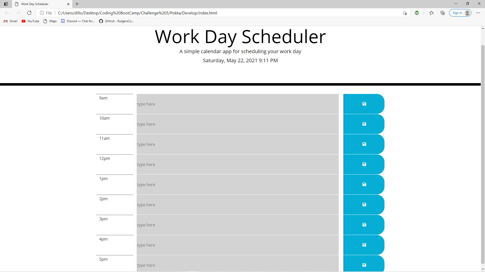
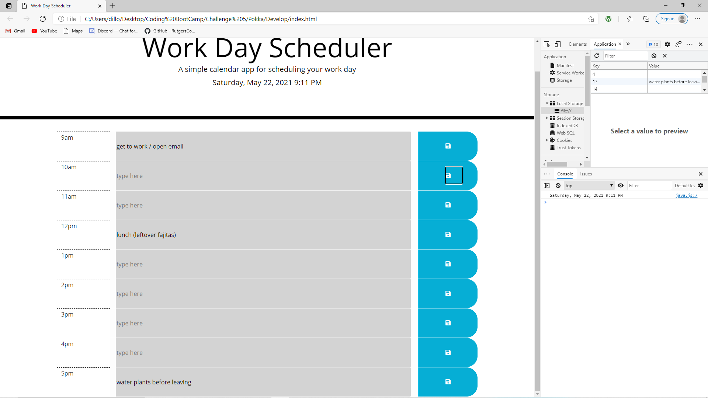

# Work Day Scheduler

## Purpose
To organize tasks by hour throughout the workday and track if they are due in past, present or future. 

## Built With
*HTML
*CSS
*JavaScript

## Screenshots

## Live URL
https://dwalsh93.github.io/Pokka/
